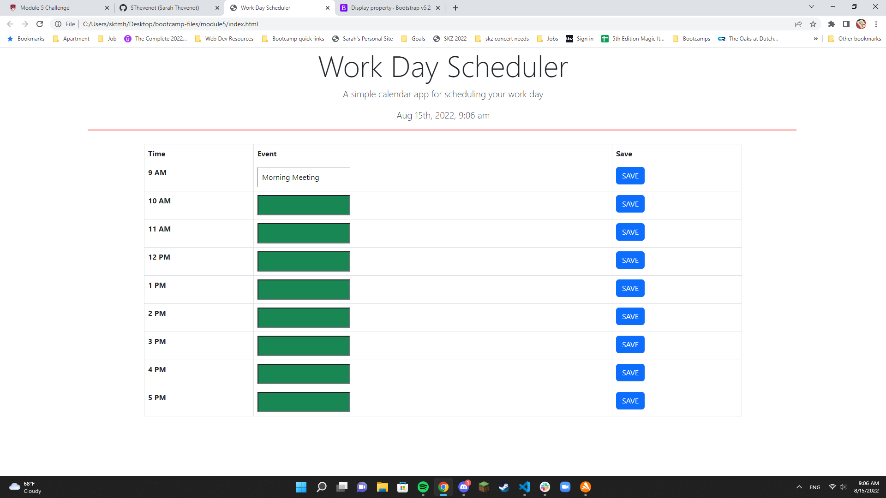
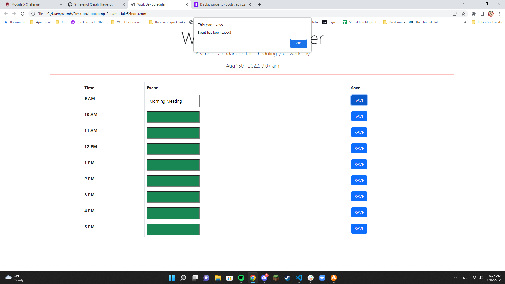

# module5

The goal of this project was to create an interactive work day planner. 

The current time and date should appear at the top of the screen and work hours should appear as well. Each block for each work hour should be a different color depending on if it's in the past, present, or future of the current time. If you press the save button, the event should be saved to local storage and should remain on the page even after it's refreshed.

